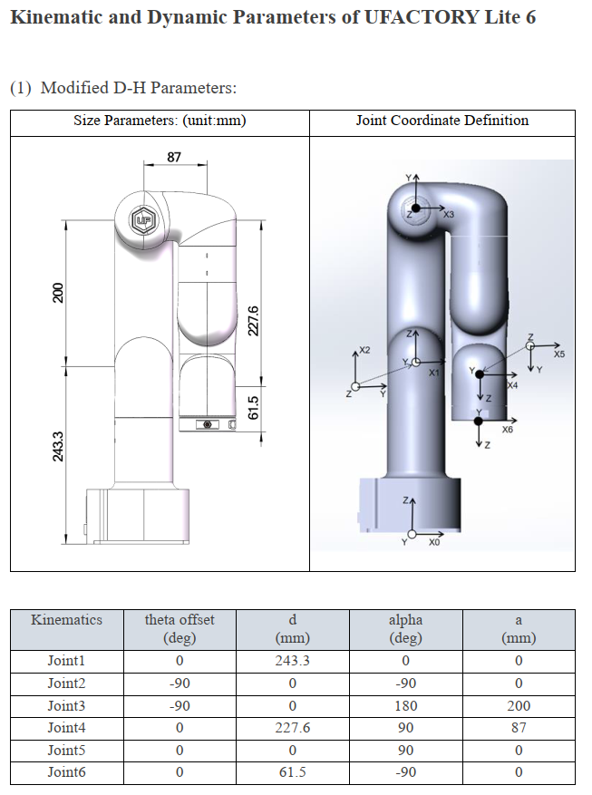
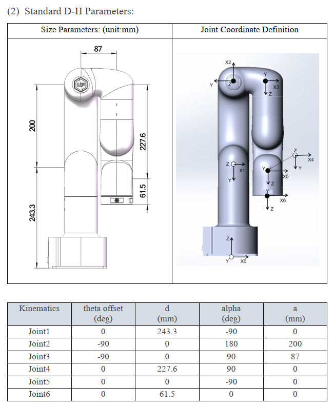
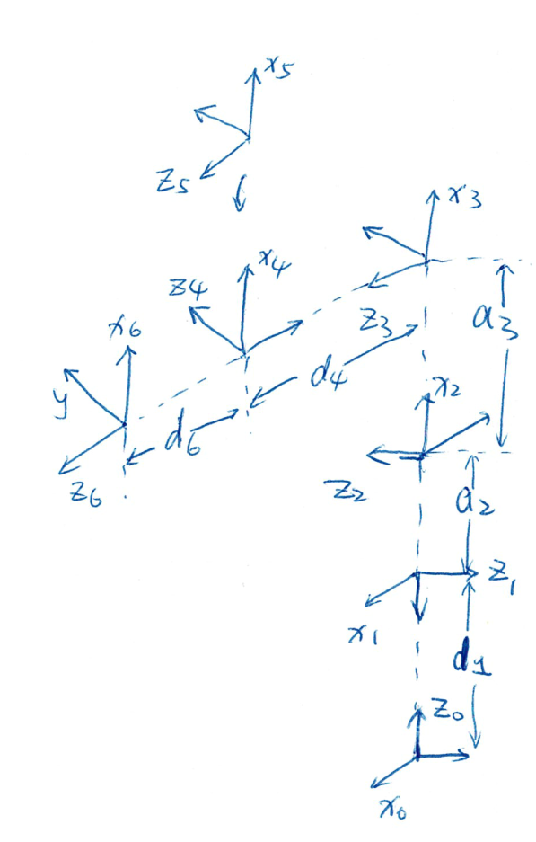

<!--
SPDX-FileCopyrightText: 2023 Kristin Kexin Wei <wkx611@outlook.com>

SPDX-License-Identifier: MIT
-->

lite6Robot_demo
===
A test cxx demo for [UFactory Lite 6 Robot](https://www.ufactory.cc/product-page/ufactory-lite-6) control

- `lite6RobotxArmCxxSDK`: built library
- `lite6Robot_xArmCxxSDK`: official source c++ library from [github](https://github.com/xArm-Developer/xArm-CPLUS-SDK)

## Robot DH Parameters

- [Denavit–Hartenberg parameters - Wikipedia](https://en.wikipedia.org/wiki/Denavit–Hartenberg_parameters)

| Modified                                                     | Standard                                                     |
| ------------------------------------------------------------ | ------------------------------------------------------------ |
|  |  |
| Convert to 3d view                                           |                                                              |
|  |  |

